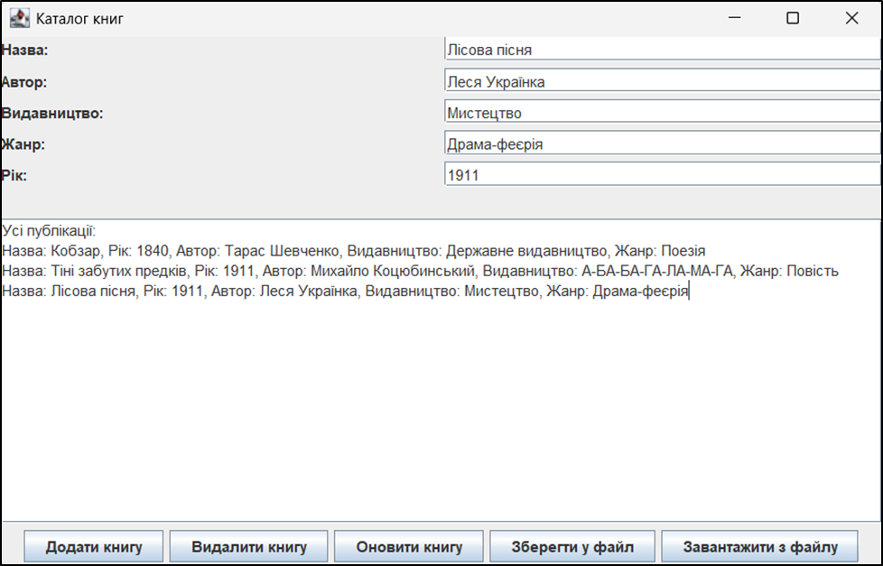

# Інформаційна система «Каталог книг»

Проєкт на мові Java (Swing), що реалізує керування каталогом публікацій з підтримкою серіалізації даних, обробкою винятків та графічним інтерфейсом.

## 📌 Основні можливості

- **Керування даними**: Додавання, видалення, оновлення та перегляд інформації про книги.
- **Пошук**: Гнучкий пошук книг за назвою (повний або частковий збіг).
- **Серіалізація**: Збереження всього каталогу у бінарний файл (`.ser` або `.dat`) та його відновлення при наступному запуску.
- **Обробка винятків**: Власна реалізація `BookNotFoundException` для контролю помилок під час видалення об'єктів.
- **Графічний інтерфейс (GUI)**: Зручне вікно на базі Java Swing.

## 🏗️ Архітектура проекту

Проєкт побудований на принципах ООП:
1.  **Publication**: Базовий клас (назва, рік).
2.  **Book**: Клас-нащадок (автор, видавництво, жанр).
3.  **Catalogue**: Клас-контейнер для збереження колекції `ArrayList<Publication>` та бізнес-логіки.
4.  **BookGUI**: Контролер інтерфейсу та точка входу (`main`).
5.  **BookNotFoundException**: Спеціалізований клас винятку.

## 🚀 Запуск та збірка

Проєкт використовує **Maven** для керування залежностями.

### Попередня перевірка
Переконайтеся, що ваші файли знаходяться у правильній структурі пакетів:
`src/main/java/com/example/*.java`

### Крок 1: Збірка проекту
Відкрийте термінал у кореневій папці та виконайте:
`mvn clean compile`

### Крок 2: Запуск програми
Використовуйте команду:
`mvn exec:java -Dexec.mainClass="com.example.BookGUI"`

_Примітка_: Якщо у Windows виникають проблеми з відображенням кирилиці, використовуйте: `mvn exec:java -D"file.encoding=UTF-8"`

### 🛠️ Використання (Тестові дані)
Для перевірки функціоналу можна використати наступні записи:

Кобзар (Т. Шевченко, 1840, Поезія)

Тіні забутих предків (М. Коцюбинський, 1911, Повість)